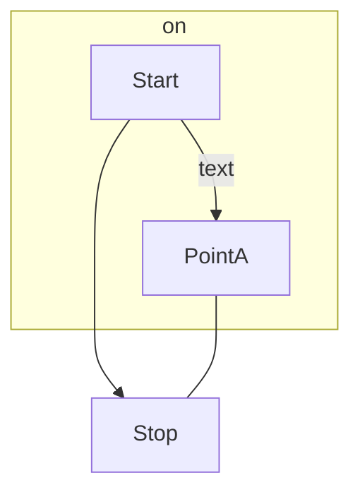

# 待ち行列理論
## 参考にした資料
http://www-optima.amp.i.kyoto-u.ac.jp/~takine/tmp/shiryou.pdf  
https://qiita.com/SaitoTsutomu/items/f67c7e9f98dd27d94608  
https://qiita.com/ogata-k/items/f5b43f96dc97c28cf49d  

## 待ち行列理論とは？
系 (待ち行列 + サーバ) に確率的に顧客がやってくる。  
顧客は自分の番が来るまで待ち行列に並んで待ち、自分の番が来たらサーバでサービスを受ける。  
顧客がサービスを受ける時間も確率的に決まる。  
サービスを受け終わった顧客は系から脱出し、次の順番待ちをしていた顧客がサーバでサービスを受ける。  
このような状況を記述する確率モデルが待ち行列理論である。  
具体的なルールを  
(顧客到着頻度の確率分布) / (サービス時間の確率分布) / (サーバ数) / (系の容量) / (サービスを受ける順番)  
の形で記述する (ケンドールの記号)。  
今回は「M/M/1/∞/先入れ先出し」の場合のみ扱う (M/M/1 と略記する)。

